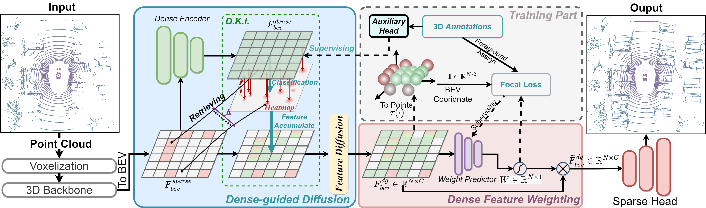

# DGFSD: Bridging the Gap between Dense and Sparse for Fully Sparse 3D Object Detection

  

## Introduction
Recently, LiDAR-based fully sparse 3D object detection has gained great attention, which utilizes point clouds to boost efficiency. Nevertheless, the relationship between well-studied dense representation and fully sparse representation is under-explored in existing studies, which focuses solely on building sparse representation by feature diffusion to solve the notorious center point missing problem. To this end, we propose a dense-guided fully sparse detection scheme, named DGFSD, to bridge the gap between dense and sparse features by dense-guided diffusion. Different from prior studies, we propose DgD (Dense-guided Diffusion) to overcome the center feature missing problem by dense knowledge transferring. Specifically, DgD transfers high-quality central point features from dense representations to endow sparse representations with dense knowledge. Moreover, we customize DFW (Dense Feature Weighting) to express uninformative representation and lift foreground representation. It makes high-quality dense feature contribute more to arcuate regression. To the best of our knowledge, we are the first to explore dense knowledge's impact on fully sparse framework.

## How to run
Following [OpenPCDet](https://github.com/open-mmlab/OpenPCDet). We will provide a detailed description of it in the future.